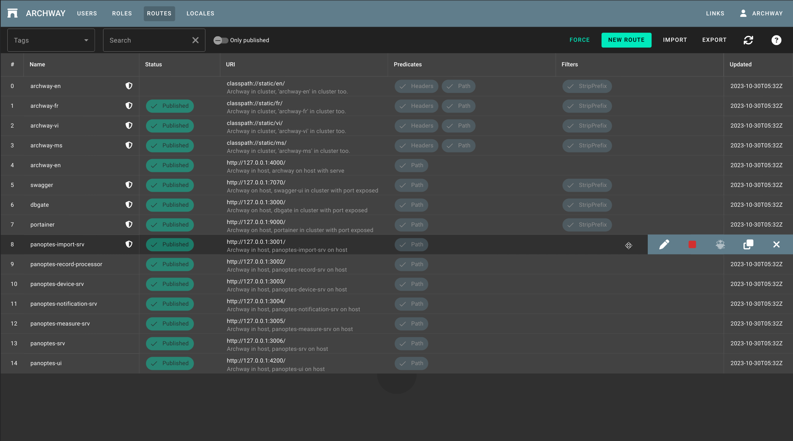

# Row-actions

[](https://github.com/hhangular/row-actions/actions/workflows/main.yml)

[](https://github.com/hhangular/row-actions/actions/workflows/tag.yml)

[](https://badge.fury.io/js/@hhangular%2Frow-actions)

## Button bar collapsable component on your table effortlessly

This library contains an standalone angular component `RowActionsComponet` that allows you to add a collapsable toolbar actions in angular material table.   

# Demo



[stackblitz](https://stackblitz.com/edit/hhangular-row-actions?file=src%2Fmain.ts)


## Component

 - **row-actions** is the main component

```html
            <ng-container matColumnDef="updated" stickyEnd>
                <mat-header-cell *matHeaderCellDef i18n="@@UPDATED">Updated</mat-header-cell>
                <mat-cell *matCellDef="let element">
                    {{element.updatedBy }}
                    <row-actions>
                      <button mat-icon-button>
                    </row-actions>
...
```

## Installation

For help getting started with a new Angular app, check out the [Angular CLI](https://cli.angular.io/).

For existing apps, follow these steps to begin using `@hhangular/row-actions` in your Angular app.

## Install @hhangular/row-actions

You can use either the npm or yarn command-line tool to install the `package`.    
Use whichever is appropriate for your project in the examples below.

### NPM

```bash
# @hhangular/row-actions
npm install @hhangular/row-actions --save 
```

### YARN

```bash
# @hhangular/row-actions
yarn add @hhangular/row-actions
```

### Peer dependence

| name | version |
|---|---|
| @angular/common | ^17.0.0 |
| @angular/core | ^17.0.0 |
| @angular/material | ^17.0.0 |


## Configuration

Just import the standalone component `RowActionsComponent` and you can use the `component`.   
You can do this in your `AppModule`, in your `SharedModule` indifferently or directly in other standalone component.

`Component.ts`
```typescript
// ================= IMPORT =================
import {RowActionsComponent} from '@hhangular/row-actions';

@Component({
  selector: 'app-demo',
  standalone: true,
  imports: [RowActionsComponent],
  template: `
  ...
  `,
})
export class Component {
  ...
}
```


`AppModule.ts`
```typescript
import {NgModule} from '@angular/core';
import {BrowserModule} from '@angular/platform-browser';
import {CommonModule} from '@angular/common';
import {HttpClientModule} from '@angular/common/http';
import {AppComponent} from './app.component';
// ================= IMPORT =================
import {RowActionsComponent} from '@hhangular/row-actions';

@NgModule({
  declarations: [
    AppComponent,
  ],
  imports: [
    BrowserModule,
    CommonModule,
    HttpClientModule,
// ================= IMPORT =================
    RowActionsComponent,
  ],
  bootstrap: [AppComponent],
  providers: []
})
export class AppModule {
}
```

--- 

`SharedModule.ts`
```typescript
import {CommonModule} from '@angular/common';
import {NgModule} from '@angular/core';
// ================= IMPORT =================
import {RowActionsComponent} from '@hhangular/row-actions';

@NgModule({
  imports: [
    CommonModule,
// ================= IMPORT =================
    RowActionsComponent,
  ],
  exports: [
// ================= EXPORT =================
    RowActionsComponent,
  ],
  declarations: [],
})
export class SharedModule {
}
```

# Use

The use of 'Component': `row-actions` is very simple.

## Use cases
You want to add a collapsable toolbar on each row to you mat-table

---

In a component template just add <row-actions> in cell with row position where you want that the toolbar appear.
If you put the <row-actions> in the first position, the toolbar will be appear from left, if you put the <row-actions> in last position,  the toolbar will be appear from right.


```html
            <ng-container matColumnDef="updated" stickyEnd>
                <mat-header-cell *matHeaderCellDef i18n="@@UPDATED">Updated</mat-header-cell>
                <mat-cell *matCellDef="let element">
                    {{element.updatedBy }}
                    <!-- IN THIS CASE THE TOOLBAR APPEAR FROM RIGHT -->
                    <row-actions>
                      <!-- ADD YOUR BUTTONS mat-icon-button HERE -->
                      <button mat-icon-button>
                    </row-actions>
```

```html
            <ng-container matColumnDef="updated" stickyEnd>
                <mat-header-cell *matHeaderCellDef i18n="@@UPDATED">Updated</mat-header-cell>
                <mat-cell *matCellDef="let element">
                    <!-- IN THIS CASE THE TOOLBAR APPEAR FROM LEFT -->
                    <row-actions>
                      <!-- ADD YOUR BUTTONS mat-icon-button HERE -->
                      <button mat-icon-button>
                    </row-actions>
                    {{element.updatedBy }}
```


## Inputs

```html
<row-actions color="warn">...</row-actions>
<row-actions [color]="'primary'">...</row-actions>
```

| name | description | type | sample |
|---|---|---|---|
| color | The row-actions color | ThemePalette = 'primary' \| 'accent' \| 'warn' \| undefined | 'warn' |


## Outputs

no
